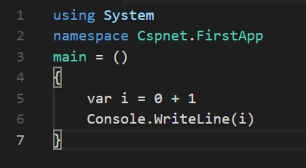
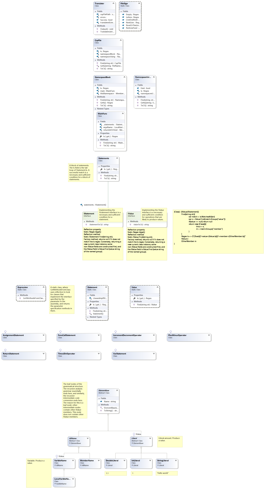

<div align="center">
    </img>
</div>


📝
***Available***
🇨🇳
***Version. View this doc in Chinese at***
[README_zh-CN](README_zh-CN.md).

Csp.net is a programming language that runs on .NET Core.

## Why Csp.net?
Csp.net is more suitable for beginners to get started.

Csp.net is more suitable for writing scripting programs. Compared with similar languages:

Programming Language | Rich library support | Convenience of scripts
------ | ------ | ------
C# and other .NET languages |   | **The amount of code is greatly reduced**, which is more suitable for script scenarios.
Python, Command and other scripting languages | **Interoperate with .NET**. It has a unique advantage on Windows. |  

### Language identifier
*Optional*

`UsingStatement` is used to introduce namespaces.
```
using System
using System.IO
```
***Required***

`NamespaceName` is used to name the current program.

*The Compiler will interpret the `NamespaceName` as the namespace name of the class(if there are multiple levels) and the name of the class.*
```
namespace MyFirstCsp.Program
```
***Required***

`MainFunc` is used to identify the **program entry point**. The parameters of the `MainFunc` can be empty `()` or String[] type parameters `(args)`, the returnType can be empty ` ` or int type `: int`.
```
main = {

} 
```
or
```
main = (): int{

} 
```
or
```
main = (args){

} 
```
or
```
main = (args): int{

} 
```

### Statements

In the pair of curly braces of the main function, the following statements are supported.

Statement | Form
------ | ------
Var | var `varible`~~: `type`~~ ~~= `value`~~     *(There is always one that is necessary in `type` and `value`)*
FuncCall | `obj`.`func`(`paras`)
Return | return `value`
++-- | `field` `++\|--`
= | `field` = `value`

### Operation

When a value is required, the following operations are supported.

Operation | Form
------ | ------
+-*/ | `value` `+\|-\|*\|/` `value`
= | `field` = `value`
FuncCall | `obj`.`func`(`paras`)

## Principle

The core algorithm is not a compilation principle, but a new algorithm that constructs a syntax tree recursively with a regex as the core.

### Analysis



->The generated syntax tree:


### Algorithm


Implementing the IValue interface is a **necessary and sufficient condition** for operations that are likely to produce values. The meaning of IValue is that it can be **any** operation that produces a value when decomposing a syntax element. It can be "return a + 2", can be "return f(a + 2)", or even "return f(a + 2) + 1 ", you can abstract this statement as a return value. Among them, value must use *recursive* analysis.

Value is a collection of all classes that implement the IValue interface.

The IValue interface defines a Regex field Is. Matching it always belongs to the **necessary and sufficient** conditions of this statement. Is contains some **fixed** strings and some named groups.

Classes that implement the IValue interface always contain some fields. These fields represent some of the **variable** strings that this statement contains. Some of them are IValue and some are not IValue. The values of these fields are always the same as the values of the named groups of the match.

For example, the Is definition of an assignment statement is roughly Is = $"(?<varible>{Varible.Is}) = (?<value>{Value.Is})". Where varible is not an IValue named group, it can be directly constructed and assigned to the corresponding field of the new instance; value is an IValue named group, which must be analyzed recursively until the **leaf node** (field, literal) of the syntax tree. Thus, the "f(a + 2) + 1" in the example is decomposed into an addition operation, where the pre-operand field is now "f(a + 2)" and the last operand is "1". The pre-operand will in turn resolve the function call. The function is now "f" and the argument is now "a + 2". The parameters are then broken down into addition operations, where the pre-operand field is now "a" and the last operand is "2".

The recursive function Value.Find will call the Find methods of the classes in the collection. If the return value has a *unique* non-null value, it will be returned. Otherwise, the parameter has a syntax error and returns null.

The IValue interface defines a Find method that accepts a String argument. This method matches Is with the argument and returns null if it does not succeed. On the contrary, it belongs to this statement. Then use the non-IValue named group to construct the corresponding field and assign it to the new instance, then pass the Value named group to Value.Find for recursion. If the return value is non-null value, assign it to the corresponding field; otherwise, there is syntax errors in the named group, returns null.

Statement is similar to Value. However, Statement only performs a "find" process, and the relevant statement class is constructed accordingly, and Value.Find is generally called.

### Architecture

[UML](Translation/Generate.cd)
*(Can be opened in Visual Studio)*


## License

[Apache-2.0](https://github.com/Anti-Li/Csp.net-Complier/blob/master/LICENSE)

### Original author

@[Anti-Li](https://github.com/Anti-Li)

In July 2018, in the 19th "China Mobile 'AND Education' Cup" **International School Student ICT Innovation Competition of China** held by the National Center for Educational Technology and other units, this project won the first prize of the computer programming of the *junior high* group.
