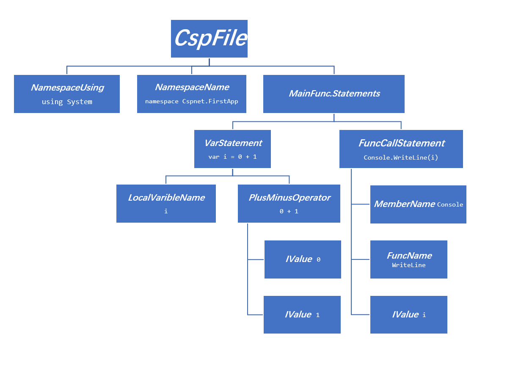
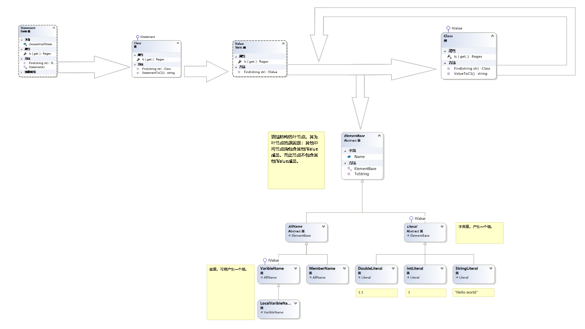
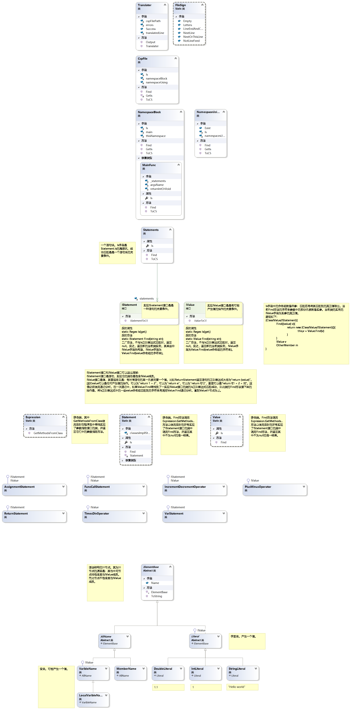

<div align=right>
    </img>
</div>


Csp.net是一门运行在.NET Core上的编程语言。

## Why Csp.net?
Csp.net更适合初学者入门。
Csp.net更适合编写脚本类程序。与同类语言相比：
编程语言 | 丰富的库支持 | 脚本的便捷性
------ | ------ | ------
C#等.NET语言 |   | 代码量大幅减少，更适合脚本的应用场景。
Python、Command等脚本语言 | 与.NET互操作。在Windows上有得天独厚的优势。|  

### 语言标识符
*可选*

`UsingStatement`用于引入命名空间。
```
using System
using System.IO
```
***必要***

`NamespaceName`用于命名当前程序。

*编译器会将`NamespaceName`解释为类所在的命名空间名称（如果它是多级别的）和类的名称*
```
namespace MyFirstCsp.Program
```
***必要***

`MainFunc`用于标识程序入口点。 `MainFunc`的参数可以是空的`()`或String[]类型的`(args)`, 返回类型可以是空的` `或int类型的`: int`.
```
main = {

} 
```
or
```
main = (): int{

} 
```
or
```
main = (args){

} 
```
or
```
main = (args): int{

} 
```

### 语句

在MainFunc的花括号中，以下语句受支持。

语句 | 形式
------ | ------
Var | var `varible`~~: `type`~~ ~~= `value`~~     *(There is always one that is necessary in `type` and `value`)*
FuncCall | `obj`.`func`(`paras`)
Return | return `value`
++-- | `field` `\+\+|\-\-`
= | `field` = `value`

### 操作

当需要一个值时，以下操作受支持。

操作 | 形式
------ | ------
+-*/ | `value` `\+|\-|\*|/` `value`
= | `field` = `value`
FuncCall | `obj`.`func`(`paras`)

## 原理

核心算法不是编译原理，而是一种以正则表达式为核心递归构造语法树的新算法。

### 分析


->


### 算法



实现IValue接口是是有可能产生值的操作的 **充要条件** 。IValue的意义是分解语法元素时可以是 **任何** 产生值的操作，可以为"return a + 2"，可以为"return f(a + 2)"，甚至可以是"return f(a + 2) + 1"，可以将此语句抽象为return value。其中，value便必须使用 *递归* 分析。
Value是所有实现了IValue接口的类的集合。
IValue接口定义了一个Regex字段Is。与之匹配总是属于这种语句的 **充要条件**。Is中含有一些 **固定** 字符串和一些命名组。
实现IValue接口的类总是含有一些字段。这些字段代表这种语句含有的一些 **可变的** 字符串。其中部分是IValue的，部分非IValue。这些字段的值总是与匹配的命名组的值相同。
比如，赋值语句的Is定义大致为 Is = $"(?<varible>{Varible.Is}) = (?<value>{Value.Is})"。其中varible不是一个IValue命名组，可以直接构造并赋给新实例的相应字段；value是一个IValue命名组，必须递归分析，直到这个语法树的 **叶节点** (字段、字面值)。这样，例子中的"f(a + 2) + 1"就分解成了相加操作，其中前操作数字段此时为"f(a + 2)"，后操作数为"1"。前操作数又将分解函数调用，函数此时为"f"，参数此时为"a + 2"。参数又将分解为相加操作，其中前操作数字段此时为"a"，后操作数为"2"。
递归函数Value.Find会调用集合中类的Find方法，如果返回值存在 *唯一* 非null值，返回之；反之，则参数存在语法错误，返回null。
IValue接口定义了一个接受String参数的Find方法。此方法将Is与参数相匹配，如果不成功返回null。反之，属于这种语句。之后先使用非IValue命名组构造相应字段并赋给新实例，再将Value命名组传入Value.Find进行递归，如果返回值非null，赋给相应字段；反之，则命名组处存在语法错误，返回null。
Statement与Value类似。不过，Statement只进行一次“寻找”的过程，就由确定的语句类进行相关构造，一般地会调用Value.Find。


Translater/Generate-zh_CN.cd